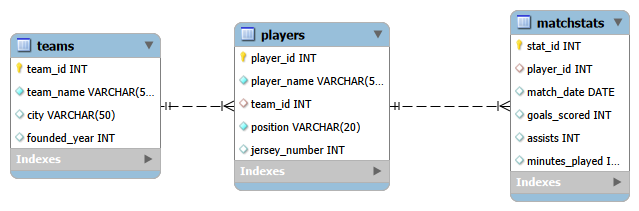
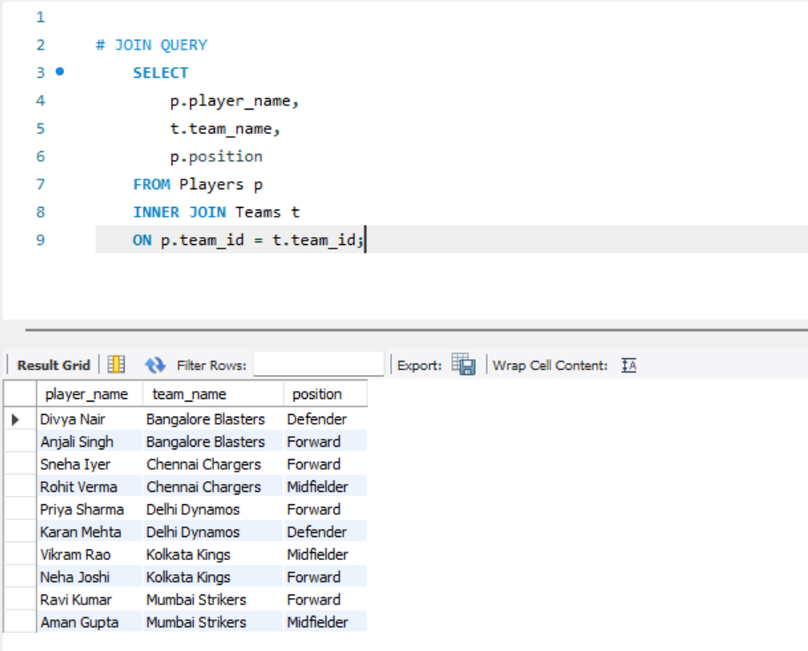
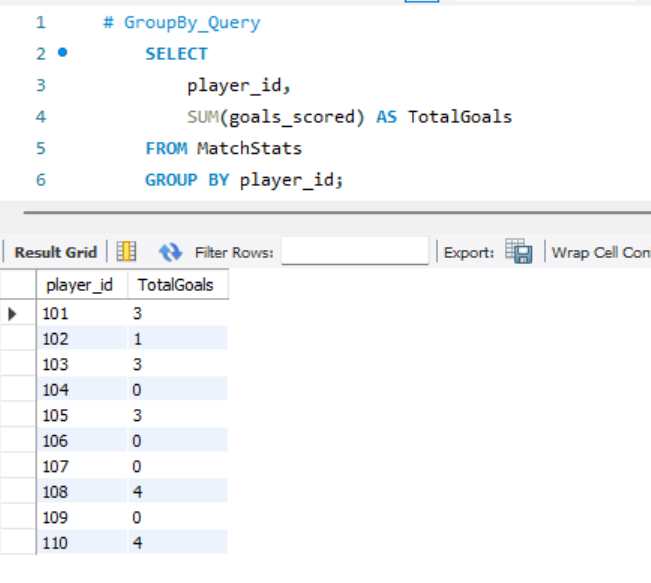
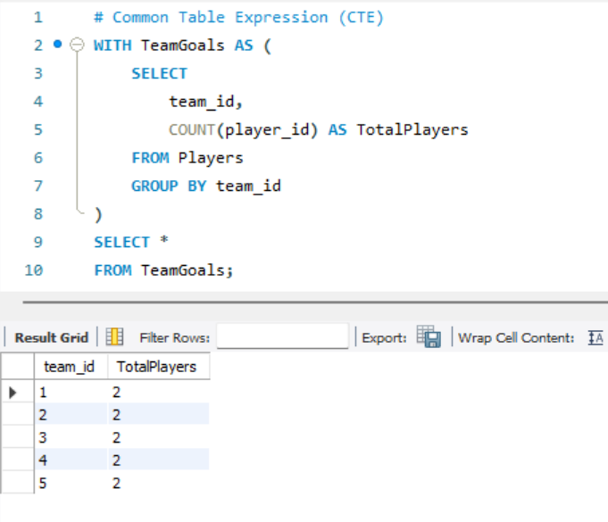

# ⚽ Football Database – SQL Practice

## 📌 Overview

This project is a SQL practice exercise completed while learning **MySQL**.

It demonstrates the design of a simple football database and the implementation of SQL queries for retrieving and analyzing data.

---

## 🗄️ Database Schema

The database consists of the following tables:

- Teams
- Players
- MatchStats

---

## 📊 Entity Relationship Diagram



---

## 📚 SQL Concepts Demonstrated

- CREATE TABLE
- INSERT INTO
- PRIMARY KEY
- FOREIGN KEY
- NOT NULL
- UNIQUE
- CHECK
- DEFAULT
- SELECT
- WHERE
- ORDER BY
- INNER JOIN
- GROUP BY
- HAVING
- Aggregate Functions (`COUNT`, `SUM`, `AVG`, `MIN`, `MAX`)
- VIEW
- Subqueries
- Common Table Expressions (CTEs)

---

## 📝 Sample Queries

### INNER JOIN

```sql
SELECT
    p.player_name,
    t.team_name,
    p.position
FROM Players p
INNER JOIN Teams t
ON p.team_id = t.team_id;
```

### GROUP BY

```sql
SELECT
    player_id,
    SUM(goals_scored) AS TotalGoals
FROM MatchStats
GROUP BY player_id;
```

### HAVING

```sql
SELECT
    player_id,
    SUM(goals_scored) AS TotalGoals
FROM MatchStats
GROUP BY player_id
HAVING SUM(goals_scored) > 2;
```

### Subquery

```sql
SELECT player_name
FROM Players
WHERE player_id IN (
    SELECT player_id
    FROM MatchStats
    WHERE goals_scored > 2
);
```

### Common Table Expression (CTE)

```sql
WITH PlayerGoals AS (
    SELECT
        player_id,
        SUM(goals_scored) AS TotalGoals
    FROM MatchStats
    GROUP BY player_id
)
SELECT *
FROM PlayerGoals
WHERE TotalGoals > 3;
```

---

## 📸 Project Screenshots

### Entity Relationship Diagram


### INNER JOIN



### GROUP BY



### Subquery


### Common Table Expression (CTE)



---

## 🎯 Learning Outcomes

Through this project, I practiced:

- Designing relational databases
- Creating and managing tables
- Writing SQL queries
- Using JOIN operations
- Aggregating data with GROUP BY and HAVING
- Creating SQL Views
- Writing Subqueries
- Using Common Table Expressions (CTEs)

---

## 🛠️ Tools Used

- MySQL
- MySQL Workbench

---

## 📌 Note

This project was created for learning and practice purposes as part of my SQL learning journey.
